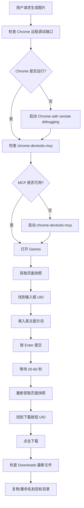
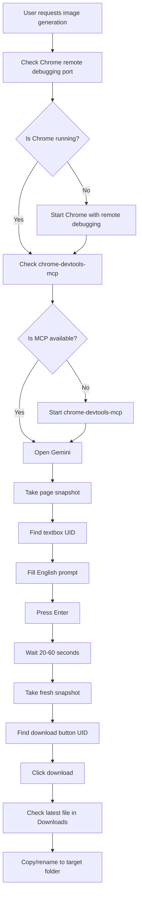

# Gemini Browser Image Skill / Gemini 浏览器图片生成技能

[English](#english) | [中文](#中文)

---

## 中文

这是一个通过 **Chrome 浏览器 + Gemini 网页版** 生成 AI 图片并下载到本地的 AgentSkill。

它适合用于：

- 公众号封面图/正文配图
- 文章插图
- 社交媒体配图
- 产品图、食物图、概念图
- 当你没有图片生成 API，但可以使用 Gemini 网页时的自动化图片生成

核心流程：

**启动 Chrome → 打开 Gemini → 输入提示词 → 等待生成 → 点击下载 → 复制到目标目录**

---

### 工作流程图



---

### 运行必要条件

#### 1. AgentSkill 运行环境

需要一个支持 `SKILL.md` 的 Agent 环境，例如：

- OpenClaw
- Codex/Codex-like AgentSkill runtime
- 其他兼容 AgentSkill 的智能体系统

#### 2. Chrome 浏览器

需要安装 Chrome，并能以远程调试模式启动：

```powershell
Start-Process "C:\Program Files\Google\Chrome\Application\chrome.exe" -ArgumentList "--remote-debugging-port=9222","--user-data-dir=<your-chrome-user-data-dir>"
```

建议使用已经登录 Gemini 的 Chrome 用户数据目录。

#### 3. Gemini 网页访问权限

需要：

- 能访问 `https://gemini.google.com`
- Chrome 里已登录可使用 Gemini 的账号
- Gemini 当前账号支持图片生成能力

#### 4. MCP/浏览器控制工具

推荐：

- `mcporter`
- `chrome-devtools-mcp`

常见启动方式：

```powershell
npx chrome-devtools-mcp@latest --autoConnect --experimentalStructuredContent --experimental-page-id-routing
```

#### 5. 下载目录权限

Agent 需要能读取浏览器下载目录，并把生成的图片复制到目标目录。

---

### 安装方式

```powershell
git clone https://github.com/jiao1yin2he3/gemini-browser-image-skill.git
```

然后将目录放入你的 AgentSkill 搜索路径中，例如：

```text
~/.openclaw/skills/gemini-browser-image/
```

---

### 使用方式

安装后，对 Agent 说：

```text
生成一张公众号封面图，主题是杭州城市更新，风格要现代、干净、有新闻感。
```

或：

```text
给这篇文章生成 1 张封面图和 4 张正文配图。
```

Agent 会根据 `SKILL.md` 使用 Chrome + Gemini 完成图片生成和下载。

---

### 提示词建议

优先使用英文提示词，效果通常更稳定。

封面图：

```text
Professional editorial hero image for a WeChat article about <topic>, modern design, clean composition, cinematic lighting, high quality, no text
```

正文配图：

```text
Editorial illustration for article section about <point>, realistic but polished, warm natural light, high quality, 16:9 aspect ratio, no text
```

---

### 注意事项

- 每次操作前都要重新获取页面快照。
- 输入框和下载按钮 UID 会变化，不要复用旧 UID。
- 图片生成通常需要 20–60 秒。
- 下载后及时复制并重命名，避免多个 Gemini 图片混淆。
- 不要把 Chrome 用户数据目录、Cookie、账号信息提交到仓库。

---

## English

This is an AgentSkill for generating AI images through the **Chrome browser + Gemini web UI**, then downloading them locally.

It is useful for:

- WeChat Official Account cover and body images
- article illustrations
- social media visuals
- product, food, and concept images
- environments where no image generation API is available but Gemini web access works

Core workflow:

**start Chrome → open Gemini → enter prompt → wait for generation → click download → copy to target folder**

---

### Workflow diagram



---

### Requirements

#### 1. AgentSkill runtime

You need an agent environment that supports `SKILL.md`, such as:

- OpenClaw
- Codex or a Codex-like AgentSkill runtime
- another AgentSkill-compatible system

#### 2. Chrome browser

Chrome must be installed and runnable with remote debugging enabled:

```powershell
Start-Process "C:\Program Files\Google\Chrome\Application\chrome.exe" -ArgumentList "--remote-debugging-port=9222","--user-data-dir=<your-chrome-user-data-dir>"
```

Use a Chrome profile that is already logged in to Gemini.

#### 3. Gemini web access

You need:

- access to `https://gemini.google.com`
- a logged-in Gemini account in Chrome
- Gemini image generation enabled for that account

#### 4. MCP/browser automation tools

Recommended:

- `mcporter`
- `chrome-devtools-mcp`

Typical startup:

```powershell
npx chrome-devtools-mcp@latest --autoConnect --experimentalStructuredContent --experimental-page-id-routing
```

#### 5. Download folder access

The agent must be able to read the browser Downloads folder and copy generated images to the target folder.

---

### Installation

```powershell
git clone https://github.com/jiao1yin2he3/gemini-browser-image-skill.git
```

Then place the folder in your AgentSkill search path, for example:

```text
~/.openclaw/skills/gemini-browser-image/
```

---

### Usage

After installation, ask your agent:

```text
Generate a WeChat article cover image about Hangzhou urban renewal. Make it modern, clean, and editorial.
```

or:

```text
Generate one cover image and four body images for this article.
```

The agent should use Chrome + Gemini according to `SKILL.md`.

---

### Prompt tips

English prompts usually work better.

Cover image:

```text
Professional editorial hero image for a WeChat article about <topic>, modern design, clean composition, cinematic lighting, high quality, no text
```

Body image:

```text
Editorial illustration for article section about <point>, realistic but polished, warm natural light, high quality, 16:9 aspect ratio, no text
```

---

### Notes

- Always take a fresh page snapshot before acting.
- Textbox and download button UIDs change often; never reuse stale UIDs.
- Image generation usually takes 20–60 seconds.
- Copy and rename downloaded images immediately to avoid confusion.
- Do not commit Chrome user data, cookies, or account information.
